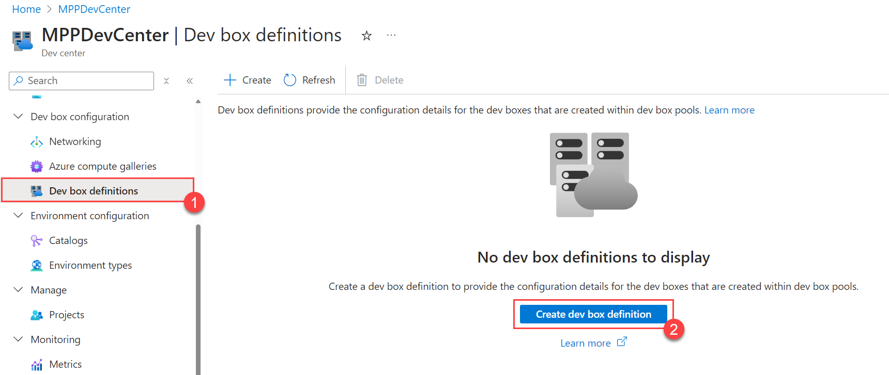
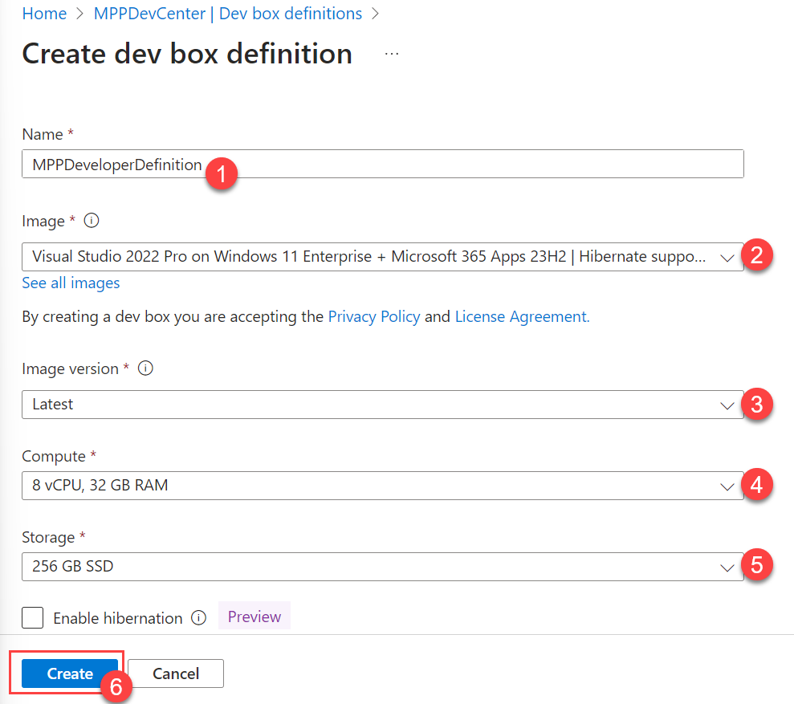
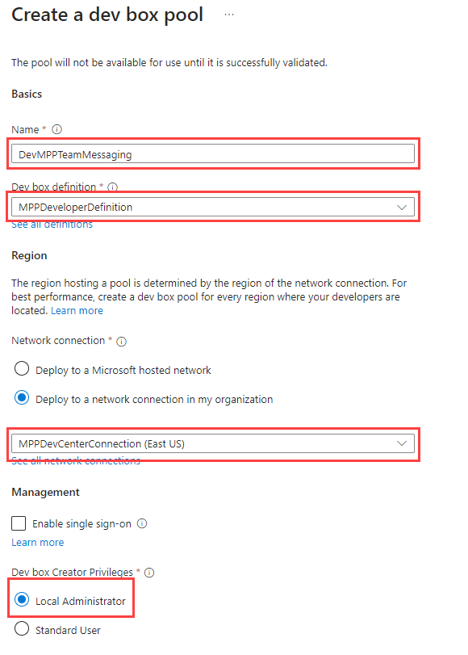
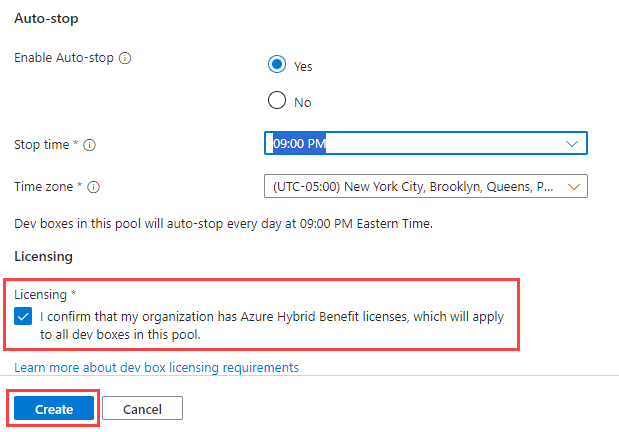
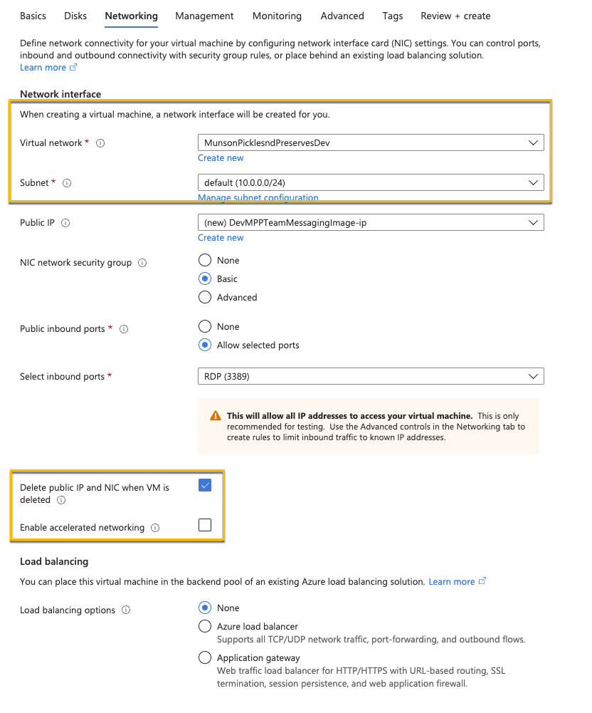
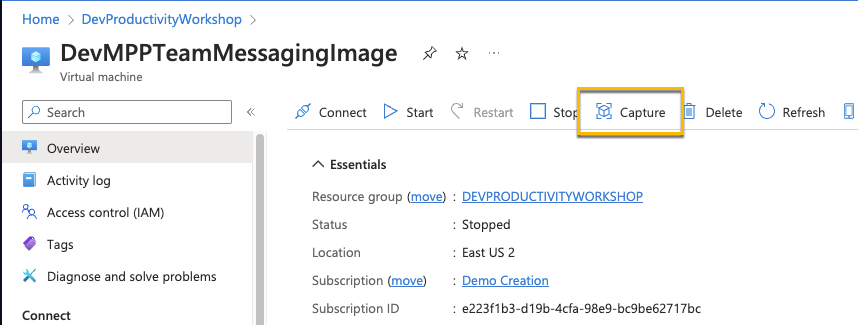

# Task 02 - Deploy a Microsoft Dev Box (40 minutes)

## Description

Typically, when a developer needs to have an environment configured for their development tasks, they need software deployed, specific versions of tools and source code, any other configurations for their development tasks. This can be a time-consuming process, particularly when onboarding a new developer or switching to a new development project.

If developers are working on multiple projects, they may even have challenges with those different projects requiring different versions of the same software. In this task, you'll load an existing Dev Box definition based on a standard Windows Image.

If you do want to try to create a custom image instead of using a pre-built definition, review the Advanced Challenges section below. Note that this advanced challenge may take upwards of two hours to complete.

1. Create a dev box definition using the latest version of the **Visual Studio 2022 Pro on Windows 11 Enterprise + Microsoft 365 Apps 23H2** image. Call this definition `MPPDeveloperDefinition`. Set the compute to 8 vCPU and 32 GB of RAM and the storage to 256 GB SSD.
2. Create a dev box pool using your definition. Ensure that it deploys to the network connection you created in the prior task and that users should have Local Administrator rights.
3. Instantiate the machine using the [Microsoft developer portal](https://devportal.microsoft.com/).
4. Install the following software on your machine:

     - Docker ([https://docs.docker.com/desktop/install/windows-install/](https://docs.docker.com/desktop/install/windows-install/))
     - Visual Studio Code ([https://code.visualstudio.com/Download](https://code.visualstudio.com/Download))
     - Azure Storage Explorer ([https://azure.microsoft.com/products/storage/storage-explorer/](https://azure.microsoft.com/products/storage/storage-explorer/))

## Learning Resources

- [Quickstart: Configure Microsoft Dev Box](https://learn.microsoft.com/azure/dev-box/quickstart-configure-dev-box-service?wt.mc_id=mdbservice_acomdoc01_webpage_cnl&tabs=AzureADJoin)
- [Create a dev box by using the developer portal](https://learn.microsoft.com/azure/dev-box/quickstart-create-dev-box?wt.mc_id=mdbservice_acomdoc02_webpage_cnl)
- [Configure a managed identity for a dev center](https://learn.microsoft.com/azure/deployment-environments/how-to-configure-managed-identity)

## Tips

- To access the Dev Portal for logging in as a user visit: [https://devportal.microsoft.com/](https://devportal.microsoft.com/).
- Ensure you assign the [appropriate RBAC roles](https://learn.microsoft.com/azure/dev-box/how-to-dev-box-user) for the users who to access the dev portal to login to a virtual machine.
- The first time you need a virtual machine, you need to first create it. It can take a little bit to create the VM the first time.

## Solution

Part 1: Expand this section to view the solution for creating a standard Dev Box definition.

1. In the Azure Portal, navigate to the Dev center you created in Task 1, and select **Dev box definitions** from the menu. Then, select **Create dev box definition**.

    

2. Create a new dev box definition with the following settings and select Create.
     - Name: "MPPDeveloperDefinition"
     - Image: Visual Studio 2022 Pro on Windows 11 Enterprise + Microsoft 365 Apps 23H2
     - Image version: Latest
     - Compute: 8vCPU, 32 GB RAM
     - Storage: 256 GB SSD

    

Part 2: Expand this section for the solution to setup a dev box pool with your definition

1. Navigate to Manage dev box pools, and create a dev box pool

   

2. Configure the settings as seen below. Use your Dev Box Definition (standard or custom) you just created as well as the network connection you created in Task 1. You may also want to adjust the auto-stop time for your region and lab length.

   

   

3. Finally, for the Project, under Access control, assign yourself and any other users to be a "DevCenter Dev Box Users"

    

4. Log into your dev box and install the software you'll need for the rest of the training. Install the following software.
     - Docker ([https://docs.docker.com/desktop/install/windows-install/](https://docs.docker.com/desktop/install/windows-install/))
     - Visual Studio Code ([https://code.visualstudio.com/Download](https://code.visualstudio.com/Download))
     - Azure Storage Explorer ([https://azure.microsoft.com/products/storage/storage-explorer/](https://azure.microsoft.com/products/storage/storage-explorer/))

## Advanced Challenges

Companies may wish to create their own custom images for developer machines, finding the default images a bit limiting. Microsoft Dev Box can accommodate those demands as well, creating a custom virtual machine and converting it into an image definition.

1. Create a compute gallery & add it to the Dev center
2. Create a custom image using **Windows 11 Enterprise, version 22H2 - x64 Gen2**

   {: .note }
   > Make sure you select a Windows 11 **Enterprise** image and **not** Windows 11 Pro. The Pro version is not supported for Microsoft Dev Box.

3. Include the following software on the custom image. If you have any issues selecting and copying the link you can also right click the link and select "Copy Link".

   - Visual Studio Code (System Installer):
      - [https://code.visualstudio.com/Download](https://code.visualstudio.com/Download)
      - Make sure this finishes before installing Git so you can set it as the default editor
   - Azure Storage Explorer (Install for all users):
     - [https://azure.microsoft.com/products/storage/storage-explorer/](https://azure.microsoft.com/products/storage/storage-explorer/)
   - Git bash:
     - [https://git-scm.com/download/win](https://git-scm.com/download/win)
     - 64bit git for Windows Setup
     - You may want to set the default editor to VSCode, keep the defaults for everything else.
   - .NET SDK 8.0 LTS:
     - [https://dotnet.microsoft.com/download/visual-studio-sdks](https://dotnet.microsoft.com/download/visual-studio-sdks)
     - .NET 8.0 x64 Visual Studio 2022 SDK

4. Before running sysprep, shut down the VM and take a snapshot. Before running sysprep, shut down the VM and take a snapshot. Once you have a snapshot, boot the VM back up, login and run sysprep on the VM. Once you perform a sysprep you can't start the VM back up again without using this snapshot. Once you perform a sysprep you can't start the VM back up again without using this snapshot.
5. Perform sysprep. To do so:
   - Delete C:\Windows\Panther and empty the recycle bin
   - In the command prompt, CD to C:\Windows\System32\SysPrep and run `sysprep.exe /oobe /generalize /shutdown`
6. Create the new image
   - For the VM image definition, create a new one with the name "DevBoxProject" and leave everything else as default
   - VM version number can be 1.0.0
   - Default storage SKU: Premium SD LRS
   - Review + create --> Create
  
{: .important }
> It can take anywhere from 20 minutes to an hour to create the image. If it still hasn't completed after 15 or 20 minutes. You can start on Exercise 2 using a different machine. Task 3 of exercise 1 depends on the completely of this image creating.  It is ok to use your own computer for Day 1 and use the Dev Box on day 2.

## Advanced Challenges Learning Resources

- [Create an Azure Compute gallery](https://learn.microsoft.com/azure/virtual-machines/create-gallery?tabs=portal%2Cportaldirect%2Ccli2)
- [Create a Dev Box Definition](https://learn.microsoft.com/azure/dev-box/quickstart-configure-dev-box-service?tabs=AzureADJoin#3-create-a-dev-box-definition)
- [Generalize a VM](https://learn.microsoft.com/azure/virtual-machines/generalize)
- [Create an image from a VM](https://learn.microsoft.com/azure/virtual-machines/capture-image-portal)

## Advanced Challenges Tips

- For the image creation, use the VM Size: Standard D4s v5 (4 vCPUs, 16 GiB memory) with a **Windows 11 Enterprise, version 22H2 - x64 Gen2** Image
- After running sysprep on a virtual machine in Azure, you can't use it again, so you can delete the VM along with it's associated resources (NIC, Disk, etc.)
- For security, once you create the VM with RDP access, go into the networking settings and set the RDP access Source to be limited to your IP address
- If you do need to make changes to your VM after you ran sysprep, you'll need to restore from the snapshot
    1. Create a new disk from the snapshot
    2. Create a new VM from the new managed disk
    3. Make your updates on the VM
    4. Create a new snapshot
    5. Run sysprep again.

{: .note }
> It's possible that Docker for Desktop causes issues following the creation of your Dev Box due to the custom image. To resolve, it may need to be uninstalled/reinstalled once your Dev Box is created.

## Advanced Challenges Solution

Expand this section to view the solution to create your own custom image.

1. In the Azure Portal create a new Azure Compute Gallery
   
2. Configure the following properties. On the Sharing Tab you can keep the defaults. Create the Gallery.
   
3. Now creating a **Windows 11 Enterprise, version 23H2 - x64 Gen2** VM
   
4. For the settings
    - Basics:
      - Same Resource Group you've been using
      - Virtual Machine name: DevMPPTeamMessagingImage
      - Availability options: No infrastructure redundancy required
      - Security type: Trusted launch virtual machines
      - Images: Windows 11 Enterprise, version 22H2 - x64 Gen2
        - **Note: Make sure you select enterprise and not pro. Pro is not supported for Dev Box. If you don't see Enterprise as an option, select the link to see all images. The Select option under Microsoft Windows 11 will give you the option to select Windows 11 Enterprise, version 22H2 - x64 Gen2.**
      - Size: Standard_D4s_v5
      - Username: DevBoxAdmin
      - Password: *something you'll remember*
      - Licensing: Confirm
        
    - Disks:
      - Do nothing
    - Networking:
      - Make sure it's connected to the network you created in the last task
      - Check "Delete public IP and NIC when a VM is deleted":
      - Uncheck "Enable accelerated network"
        
    - Management, Monitoring, Advanced
      - Do nothing and take the defaults
    - Create the VM
5. Configure the network to only allow RDP access form you IP address
    - Under the VM Network settings click RDP in the Network Security Group. Set Source to "My IP address" and select Save
    
6. RDP Into the box and download/install the following software. When you install the software, if the option is available, make sure to select **Install for all users**:
    - Visual Studio Code (System Installer):
      - [https://code.visualstudio.com/Download](https://code.visualstudio.com/Download)
      - Make sure this finishes before installing Git so you can set it as the default editor
    - Azure Storage Explorer (Install for all users):
      - [https://azure.microsoft.com/products/storage/storage-explorer/](https://azure.microsoft.com/products/storage/storage-explorer/)
    - Git bash:
      - [https://git-scm.com/download/win](https://git-scm.com/download/win)
      - 64bit git for Windows Setup
      - You may want to set the default editor to VSCode, keep the defaults for everything else.
    - .NET SDK 8.0 LTS:
      - [https://dotnet.microsoft.com/download/visual-studio-sdks](https://dotnet.microsoft.com/download/visual-studio-sdks)
      - .NET 8.0 x64 Visual Studio 2022 SDK

    {: .important }
    > Before running sysprep, shut down the VM and take a snapshot. Once you have a snapshot, boot the VM back up, login and run sysprep on the VM. Once you perform a sysprep you can't start the VM back up again without using this snapshot.
7. Perform sysprep. To do so:
   - Delete C:\Windows\Panther and empty the recycle bin
   - In the command prompt, CD to C:\Windows\System32\SysPrep and run `sysprep.exe /oobe /generalize /shutdown`
8. After the Windows machine shuts down due to sysprep, navigate to your virtual machine in Azure.
9. Select Capture
    
10. Select the Azure computer gallery you created in Task 1
    
11. Create a new Target VM image definition
    
12. Set the Version number to 1.0.0
13. Set Default storage SKU to Premium SSD LRS
14. The configuration should look like this. Then create the image
    
    -**Note**: This step can take some time to complete. If this does not complete within approximately 20 minutes, you should continue with the machine you created during this task rather than the custom image.

