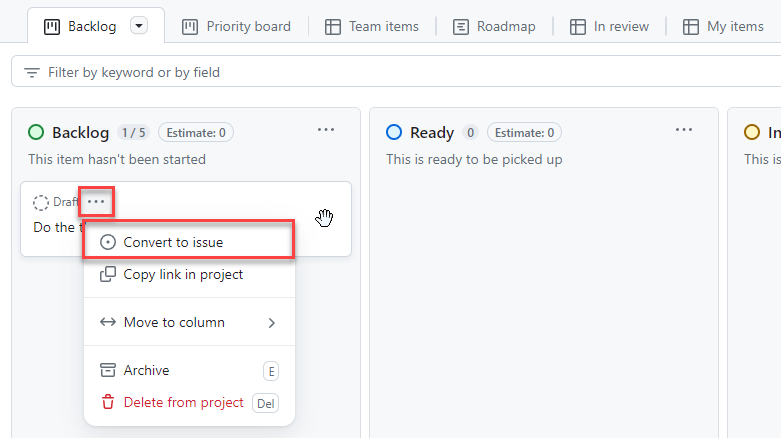

# Task 02 - Track your work (15 minutes)

## Introduction

Agile project management is a key component of building a modern DevOps culture at your organization. If you are new to Agile or just want a refresher, we recommend you review the following articles:

1. [What is Agile?](https://docs.microsoft.com/azure/devops/learn/agile/what-is-agile)
2. [What is Scrum?](https://docs.microsoft.com/azure/devops/learn/agile/what-is-scrum)
3. [What is Kanban?](https://docs.microsoft.com/azure/devops/learn/agile/what-is-kanban)
4. [What is Agile Development?](https://docs.microsoft.com/azure/devops/learn/agile/what-is-agile-development)

To help you with Agile project management, we have [GitHub project boards](https://docs.github.com/en/issues/planning-and-tracking-with-projects/learning-about-projects/about-projects). With GitHub project boards, you can quickly and easily start tracking your backlog, as well as tasks, issues, bugs, and features associated with your project.

Review the following introduction to GitHub project boards: [GitHub project boards](https://docs.github.com/en/issues/planning-and-tracking-with-projects/learning-about-projects/about-projects).

## Description

In this task, you will show the Munson's Pickles and Preserves team how to perform a variety of tasks around project and work tracking.

The key tasks are as follows:

1. Add other learners from your team room as contributors to your repository.
2. Create a new project using the **Kanban** template.
3. Ensure that this new project is linked with your repository.
4. Use the project board to create five draft issues in total, named `Issue 1`, `Issue 2`, `Issue 3`, `Issue 4`, and `Issue 5`. When creating each issue, make sure to assign an owner for each issue to someone from your team room. Then, convert `Issue 3` from a draft issue to an issue and then select the repository you have created. Look at the difference between a draft and your converted `Issue 3` issue.
5. Move all of your issues to the "Ready" column and convert each one from a draft to an issue.
6. Move `Issue 1` to the "In Progress" column.
7. Ask the team member to whom you assigned `Issue 1` to close the issue. Review your project board to see if the issue automatically moved to the "Done" column.
8. Create a new view to show all of your issues as a table.
9. Add a custom field to your issue. The custom field should be called "Complexity" and will be a single select type with the following options: Very Easy, Easy, Hard, and Very Hard.

## Success Criteria

- You have added one or more collaborators to your repo.
- You have a project board using the automation Kanban template. This project board contains five issues. Of those, four are open and a team member closed the fifth.
- New issues appear under the "New" column.
- Closed issues automatically appear under the "Done" column.
- You have a table view in addition to your Backlog Board.
- You have a custom field called Complexity on your issues.

## Learning Resources

- [Creating a project board in GitHub](https://docs.github.com/en/issues/planning-and-tracking-with-projects/creating-projects/creating-a-project)
- [Enable GitHub Issues on a repo](https://docs.github.com/en/free-pro-team@latest/github/managing-your-work-on-github/disabling-issues)
- [Inviting collaborators to a personal repository](https://docs.github.com/en/free-pro-team@latest/github/setting-up-and-managing-your-github-user-account/inviting-collaborators-to-a-personal-repository)
- [Learn more about automation with project boards](https://docs.github.com/en/issues/planning-and-tracking-with-projects/automating-your-project/using-the-built-in-automations)
- [Adding issues to a project](https://docs.github.com/en/issues/planning-and-tracking-with-projects/managing-items-in-your-project/adding-items-to-your-project)
- [Customizing views](https://docs.github.com/en/issues/planning-and-tracking-with-projects/customizing-views-in-your-project/customizing-a-view)

## Solution

Expand this section to view the solution

- In order to use issues in a forked repository, you need to enabled them.
  - In your repository, go into Settings
  - Within settings, scroll down a little bit and find Issues. The checkbox will probably be uncheck, select the checkbox to select it to add issues to your repo.
- You may only assign tickets to other team members if those members have accepted invitations to be collaborators on the repository.
- The following steps will allow you to add one or more collaborators:
  - In your repository, select **Settings** from the options menu.
  - In the **Access** menu on the left-hand side, choose the **Collaborators** option. If you have two-factor authentication enabled for your account, you may be prompted for additional authentication.
  - Select the **Add people** option from the **Manage access** section.
  - A dialog box will appear. Enter the e-mail address or username of any team members you wish to add.
  - Team members will need to accept invitations before this process is complete.
- The following steps will allow you to create an automated Kanban board:
  - In your repository, select **Projects** from the options menu.
  - Select the drop-down arrow in the **Link a project** button and select **New Project** from the menu. Then select the **New project** button.
  - Select **Kanban** in the project templates.
  - Select **Create** to generate the project board.
- The following steps will allow you to create and work with GitHub Issues:
  - In your project board, select the **Add Item** option for the **Backlog** card. Enter the text for your issue.
  - Hover over the new card and select the ellipsis that appears. Select the ellipsis and choose **Convert to issue** from the menu.

    

  - Make sure you select the correct TechExcel repository for each draft item you convert to an issue.
  - New issues, if linked properly, should show up in the "Backlog" column.  Once you set the issue to a status of Closed, it should move to the "Done" column in the project board. If you are viewing the issues from the Kanban project board, you will be able to drag issues across columns.

## Advanced Challenges (optional)

TODO: add a bug tracker project!

## Advanced Challenge Solution

Expand this section to view the advanced challenge's solution

TODO: add details on the solution

