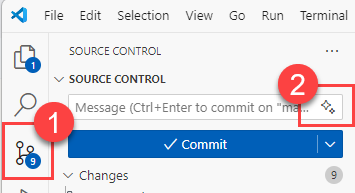
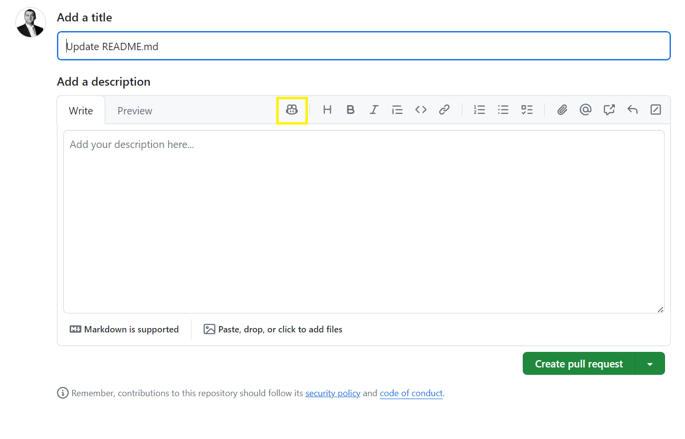

# Task 01 - Change the application (15 minutes)

## Introduction

We have a work machine configured, so now it is time to ensure that everything works as expected. We can do this by making a simple change to the demo application and ensuring that we are able to commit this code to GitHub from your machine.

## Description

Developers at Munson's Pickles and Preserves like the Team Messaging System in general, but they consistently bring up issues with one aspect of the application: it limits messages to 200 characters or fewer. Developers have made a case that the app should support messages of up to 250 characters in length instead.

In this task, you will modify the application to support 250 characters instead of 200. You will also follow a feature branching strategy and use a pull request to bring your change into the `main` branch. If you wish to complete this task using a Test-Driven Design approach, please read the **Advanced Challenges (optional)** section below before making any changes.

1. Create a new GitHub Issue indicating the desired outcome.
2. Create a new branch in GitHub for your changes.
3. Fetch changes on your machine and check out the new branch you have created.
4. Make any necessary modifications to the .NET application to change the limit on message length from 200 to 250. Be sure to update any error messages or other indicators as well so you do not have incorrect error messages or display messages. Add documentation to any code you change. Use GitHub Copilot to assist in each step of this development job.

    {: .note }
    > When running the .NET app, you will not be able to input more characters than the message length you set (either 200 or 250 characters). If you wish to test this, you will need to try a different route in a unit test ([hint](https://learn.microsoft.com/en-us/dotnet/api/system.componentmodel.dataannotations.validator.tryvalidateobject)). See the **Advanced Challenges** section for more detail.

5. Commit the changes to the feature branch in your GitHub repository. Ensure that your commit message includes verbiage to the extent of "Resolves #x", where 'x' is the issue number for the issue you created. This will allow you to auto-close the issue once your code makes it into the `main` branch via pull request. Use GitHub Copilot to generate the commit message.
6. Create a pull request from your feature branch into **your repository's** `main` branch. Be sure that your pull request is **not going to the Microsoft repository you originally forked**. Add another learner on your team as a reviewer for this pull request. Your code reviewer should read through the changes, comment on any issues, and approve the review if the change looks good. Use GitHub Copilot Enterprise to create a pull request summary.
7. After your team member reviews and approves the pull request, complete the pull request to merge the changes from your feature branch into your repository's `main` branch. Delete the feature branch upon completion.

## Success Criteria

- You are able to run your web application on your machine successfully after making changes.
- You are able to insert a message of length 250.
- You are not able to insert a message of length 251.
- All of your changes are now in the `main` branch of your GitHub repository.
- The issue you created for this ticket is now closed and the feature branch has been deleted.

## Learning Resources

- [GitHub flow](https://docs.github.com/en/get-started/quickstart/github-flow)
- [Linking a pull request to an issue](https://docs.github.com/en/issues/tracking-your-work-with-issues/linking-a-pull-request-to-an-issue)
- [Unit testing C# in .NET Core using dotnet test and xUnit](https://learn.microsoft.com/dotnet/core/testing/unit-testing-with-dotnet-test)
- [Creating parameterised tests in xUnit with InlineData, ClassData, and MemberData](https://andrewlock.net/creating-parameterised-tests-in-xunit-with-inlinedata-classdata-and-memberdata/)
- [Tutorial: Test a .NET class library using Visual Studio Code](https://learn.microsoft.com/en-us/dotnet/core/tutorials/testing-library-with-visual-studio-code)
- [Validator.TryValidateObject Method](https://learn.microsoft.com/en-us/dotnet/api/system.componentmodel.dataannotations.validator.tryvalidateobject)
- [Unit Test of MaxLengthAttribute fails](https://stackoverflow.com/questions/58177071/unit-test-of-maxlengthattribute-fails)
- [How do I invoke a validation attribute for testing?](https://stackoverflow.com/questions/5354894/how-do-i-invoke-a-validation-attribute-for-testing)
- [Xunit.Assert.True(bool)](https://www.csharpcodi.com/csharp-examples/Xunit.Assert.True(bool)/)
- [10 unexpected ways to use GitHub Copilot](https://github.blog/2024-01-22-10-unexpected-ways-to-use-github-copilot/)
- [Write Your Git Commits with GitHub Copilot (Visual Studio)](https://devblogs.microsoft.com/visualstudio/write-your-git-commits-with-github-copilot/)
- [Responsible use of GitHub Copilot pull request summaries](https://docs.github.com/en/enterprise-cloud@latest/copilot/responsible-use-of-github-copilot-features/responsible-use-of-github-copilot-pull-request-summaries)

## Solution

<details markdown="block">
<summary>Expand this section to view the solution</summary>

- To create a new GitHub Issue, select **Issues** from the GitHub options menu and then select the **New issue** button. Enter an appropriate title and comment and then choose **Submit new issue** to create it. Keep track of the issue number, as you will use it later when committing your code to source control.
- To create a new branch in GitHub, select **<> Code** from the GitHub options menu. Then, choose the "main" drop-down menu below the GitHub repository title and select **View all branches** to navigate to the branch list. Select the green **New branch** button and then enter your new branch name and select **Create new branch** to complete the process.
- On your machine, run `git fetch` from the Git bash shell to fetch the latest changes. Then, run `git checkout {new branch name}` to make that the working branch.
- The only necessary app modification is in `Application\src\RazorPagesTestSample\Data\Message.cs` and involves changing line 12. You can prompt GitHub Copilot to identify and make the change. To add documentation, first, highlight the section of code you would like to document. Then, open the GitHub prompt using `Ctrl+i` on Windows or Linux, or `Command+i` on MacOS. Type in `/doc` and strike Enter to automate the creation of documentation for this bit of code. Note that you might need to uncomment the first line of code after documentation completes.
- In Visual Studio Code, in the Source Control menu, you can select the GitHub Copilot icon to generate a commit message. Add to it a message such as "Resolves #X" where X is the issue number that you opened earlier in this task. Then, select the **Commit** button to complete the commit. After that, you can push the commit into the remote GitHub repository using the **Sync Changes** button.

    

    If you would prefer to perform a commit from the command line, there are three steps. First, to commit the change to the repository, add the changes to the working space with a command like `git add .`. Then, you can create a commit using the command, `git commit -m "Resolves #6"`, assuming that 6 is the relevant issue number. Run `git push` to push the changes from the remote branch to GitHub.
- To create a pull request in GitHub, select **Pull requests** from the GitHub options menu. Then, select the **New pull request** option. The base branch should be "main" **for your repository, not the Microsoft repository** and the compare branch should be the new branch you've created.

    

    If you see **microsoft** in the drop-down entry for your base repository, change it to your own repository.

    

    Then, select the green **Create pull request** button. On the pull request form, you may add a reviewer by selecting the gear icon in the "Reviewers" section and then selecting a user from the drop-down list or typing in a username.

    You can use GitHub Copilot Enterprise to generate a pull request summary, selecting the **Copilot options** button in the **Write** menu and then selecting the **Summary** option. This will generate a summary that you can subsequently review and edit as needed.

    

    After filling in pull request details, select the **Create pull request** button to create the pull request and alert the reviewer. Note that the GitHub website may prompt you to create a pull request on the main page or on the Pull requests page, and you may choose this option as a shortcut to save a couple of steps.
- To review a pull request, a team member should open the pull request, either directly through the link in the e-mail GitHub sends or by navigating to the appropriate repository and choosing the pull request from the **Pull requests** menu. The learner should navigate to the **Files changed** tab and review any changes, ensuring that line 12 `Message.cs` now supports 250 characters instead of 200. There may also be one or more unit test updates to review. If the review is successful, the reviewer may choose the green **Review changes** button on the right-hand side, choose the "Approve" radio button, and then select **Submit review** to complete the task.

    {: .note }
    > A separate team member must review the pull request. You cannot review and approve your own pull requests.

- Once the team member has completed the pull request, you can open the pull request and select the green button to merge changes and complete the pull request. You may also wish to select the checkbox to delete the feature branch. Alternatively, you can return to the branches list from the **<> Code** menu option and delete the branch manually.

</details>

## Advanced Challenges (optional)

Your code change did not affect any unit tests. In practice, this is a sign that we are missing at least one valid unit test case. As part of your code changes, introduce unit tests which test the insertion of a message of length 150, a message of length 199, a message of length 200, a message of length 201, a message of length 249, a message of length 250, a message of length 251, and a message length of 300. You may wish to do this as one parameterized test case ([hint](https://andrewlock.net/creating-parameterised-tests-in-xunit-with-inlinedata-classdata-and-memberdata/)).

Another challenge is that, unlike the behavior you would expect from inserting a row into a relational database, the string length decorator does not get enforced on object creation, meaning that you could create a `Message` with a `Text` length of 400 characters and not trigger an error. You will need to validate this separately ([hint](https://learn.microsoft.com/en-us/dotnet/api/system.componentmodel.dataannotations.validator.tryvalidateobject)).

Use GitHub Copilot to assist in creating the appropriate unit tests.

## Advanced Challenge Solution

<details markdown="block">
<summary>Expand this section to view the advanced challenge's solution</summary>

- Before trying this solution, use GitHub Copilot and experiment on creating additional tests. Open the `Application\tests\RazorPagesTestSample.Tests\UnitTests\DataAccessLayerTest.cs` file and try a prompt such as "Generate a unit test theory to generate messages of various lengths including 250 and try to validate the message object." You may need to create additional prompts to narrow in on the specific code necessary to test this functionality.
- The solution is to use the `Validator.TryValidateObject()` function in `System.ComponentModel.DataAnnotations` to validate the object, passing in our desired string length and expected results. Add these unit tests to `Application\tests\RazorPagesTestSample.Tests\UnitTests\DataAccessLayerTest.cs` The code for this test case is as follows:

    ```csharp
    using System.ComponentModel.DataAnnotations;
    // ...

    // This picks up inside the DataAccessLayerTest class.
    [Theory]
    [InlineData(150, true)]
    [InlineData(199, true)]
    [InlineData(200, true)]
    [InlineData(201, true)]
    [InlineData(249, true)]
    [InlineData(250, true)]
    [InlineData(251, false)]
    [InlineData(300, false)]
    public async Task AddMessageAsync_TestMessageLength(int messageLength, bool expectedValidMessage)
    {
        using (var db = new AppDbContext(Utilities.TestDbContextOptions()))
        {
            // Arrange
            var recId = 10;
            var expectedMessage = new Message() { Id = recId, Text = new string('X', messageLength) };

            // Act
            var isValidMessage = Validator.TryValidateObject(expectedMessage, new ValidationContext(expectedMessage), null, validateAllProperties: true);

            // Assert
            Assert.Equal(expectedValidMessage, isValidMessage);
        }
    }
    ```

</details>
