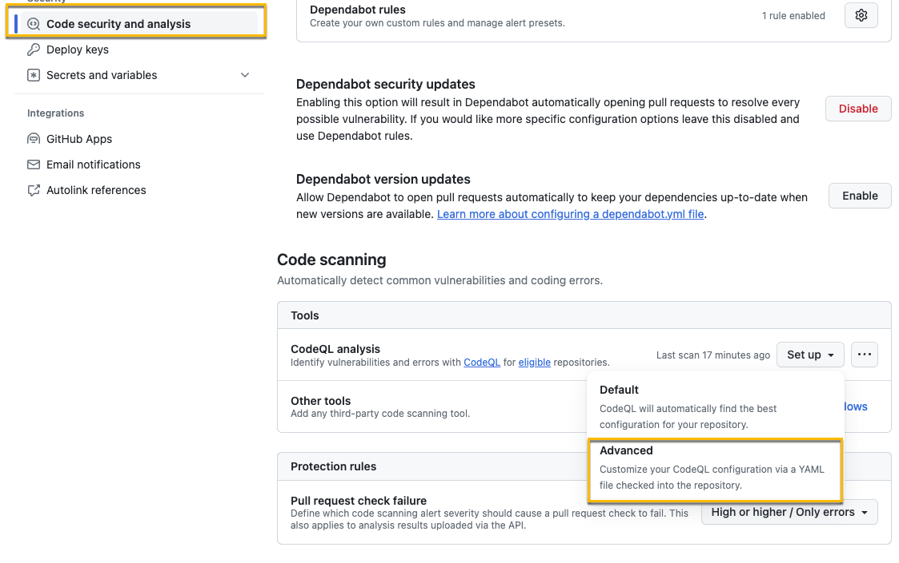
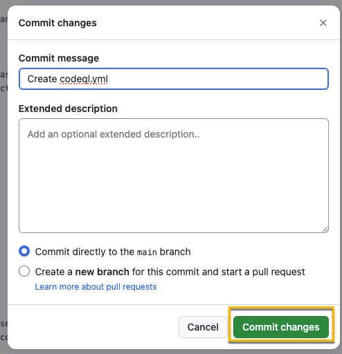
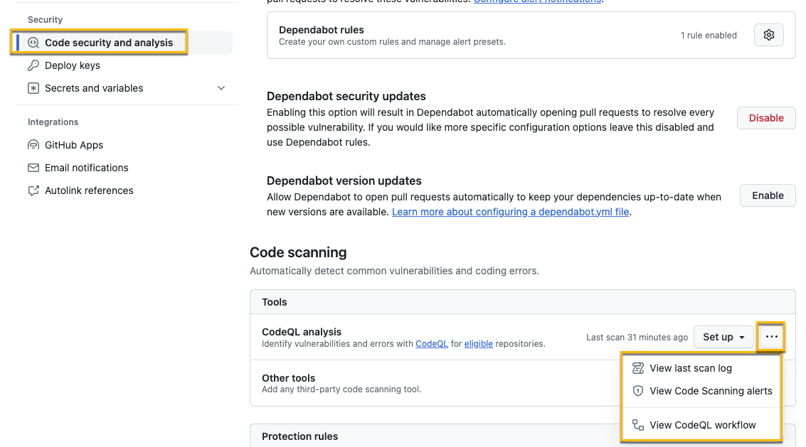

# Task 02 - Remediate in code and create a pull request summary (20 minutes)

- Ask Copilot a question in the repository: https://docs.github.com/en/enterprise-cloud@latest/copilot/using-github-copilot/asking-github-copilot-questions-in-githubcom
- Create an Issue and a feature branch
- Find the relevant calling code -- might want to ask GitHub Copilot "Is this code optimized for performance?"
- Update the code to make it faster
- Check in, use GitHub Copilot to create a pull request summary, and have another team member review the PR before merging into prod
- Let deployment complete and ensure that the web application is faster now

## Introduction

In the prior task, you identified which application call is performing the worst. In this task, the MP&P team would like you to use GitHub Copilot to resolve this issue, once again following the Git Flow: creating an Issue, creating a feature branch, resolving the issue, committing changes, creating a pull request, and deploying code out to each environment by way of a GitHub Actions workflow.

## Description

In this task, you will improve the performance of the Team Messaging System.

1. Find the location of the worst-performing code. You may wish to ask GitHub Copilot Enterprise to search for the code if you are not familiar with the layout of a .NET Razor application.
2. Create an Issue and a feature branch associated with your code changes.
3. Use GitHub Copilot to find the underlying cause of why performance is bad.
4. Use GitHub Copilot to make the code faster.
5. Check in your changes and have GitHub Copilot assist on creating the commit message.
6. Create a pull request to the main branch, using GitHub Copilot Enterprise to create a pull request summary. Have another team member review and approve your code before you merge the code into the main branch.
7. Ensure that the deployment completes and your faster (and correct) code is running on the production website.

## Success Criteria

- You have corrected the performance issue in the code.
- You have deployed the code out to each environment.
- You have tested the new code to ensure that it does not change any existing functionality.

## Learning Resources

- [Asking GitHub Copilot questions in GitHub.com](https://docs.github.com/en/enterprise-cloud@latest/copilot/using-github-copilot/asking-github-copilot-questions-in-githubcom).

## Tips

- The GitHub Copilot interface in Visual Studio Code uses as its context your current page. With GitHub Copilot Enterprise, you can ask questions of the entire repository, which may be helpful in finding where the poorly-performing code is located.

## Solution

TODO:
<details markdown="block">
<summary>Expand this section to view the solution</summary>

1. Select **Settings** in your repo, then **Code security and analysis**. Select **Enable** on "Dependabot alerts" and "Dependabot security updates."

    

    **Note** This will also automatically enable "Dependency graph."
2. Navigate to [https://github.com/electron/electron/blob/main/SECURITY.md](https://github.com/electron/electron/blob/main/SECURITY.md) for information about security policies. This is an example of a sample security policy that you could use for this exercise.
3. In your GitHub repo, select **Security**, **Policy**, and **Start setup**

   

4. Paste the security policy into the Markdown file (you can overwrite what is there now) and update it for the Munson's Pickles and Preserves Team Messaging System and the GitHub repo your code is in. Then, commit the changes to the main branch.

   

5. Next, we need to enable CodeQL. Select **Settings** and then **Code security and analysis**.
6. Scroll down if needed and select **Set up** in "Code scanning" for "CodeQL analysis."

    

7. If you select "Default", the code scan will immediately be run. For this exercise, select **Advanced**.

    

8. By choosing the advanced option, you can see the YAML for the pipeline that actually performs the code check. We don't need to make any changes here, but it's something you should be familiar with. An easy change to make in this file would be if you want to adjust the schedule of when the scan runs.

    

    After you've reviewed the YAML, commit the change to main.

    

9. After you've committed the change, select **Actions** and you should see your CodeQL Scan workflow running.

    

10. After about 5 minutes, you should see the workflow has completed.

    

11. After it's complete, go back to **Settings** and **Code security and analysis**. Then, select the ellipsis **...** next to the "Set up" menu. From the ellipsis dropdown, explore each of the first two options: "View last scan log" and "View Code Scanning alerts." You will find one High-risk vulnerability around arbitrary file access during archive extraction.

    {: .note }
    > This page will still show "Set up" because we chose the Advanced option instead of Basic.

    

12. Select the alert and then choose "Show more" to view details on the security issue. It turns out that an attacker could traverse to an arbitrary directory based on the way the MP&P staff wrote this function. In order to correct the function and prevent a directory traversal attack, replace `WriteToDirectory()` with the following code:

    ```csharp
    public static void WriteToDirectory(ZipArchiveEntry entry, string destDirectory)
    {
        string destFileName = Path.GetFullPath(Path.Combine(destDirectory, entry.FullName));
        string fullDestDirPath = Path.GetFullPath(destDirectory + Path.DirectorySeparatorChar);
        if (!destFileName.StartsWith(fullDestDirPath)) {
            throw new System.InvalidOperationException("Entry is outside the target dir: " + destFileName);
        }
        entry.ExtractToFile(destFileName);
    }
    ```

    Commit the code and create a pull request to the main branch. You should then see a CodeQL scan for the pull request, and after it succeeds, complete the pull request. Then, return to the code scanning results view and confirm that no issues remain on the list.

</details>
