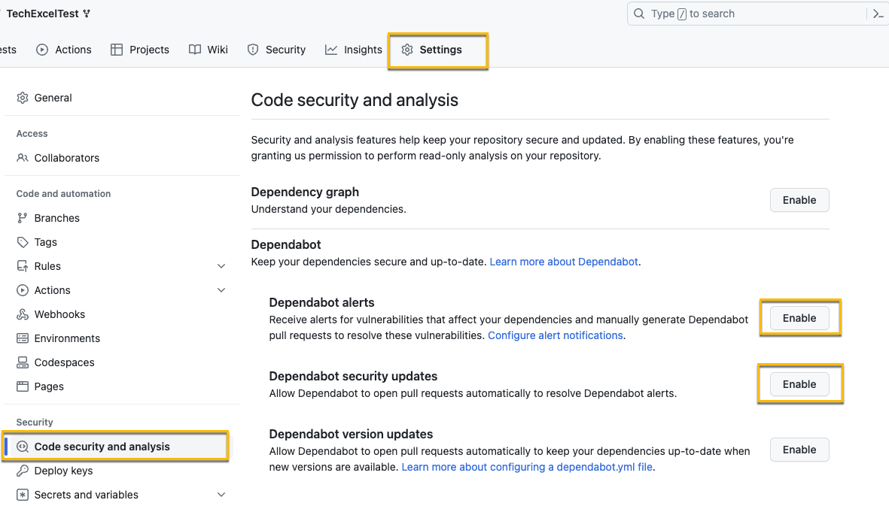
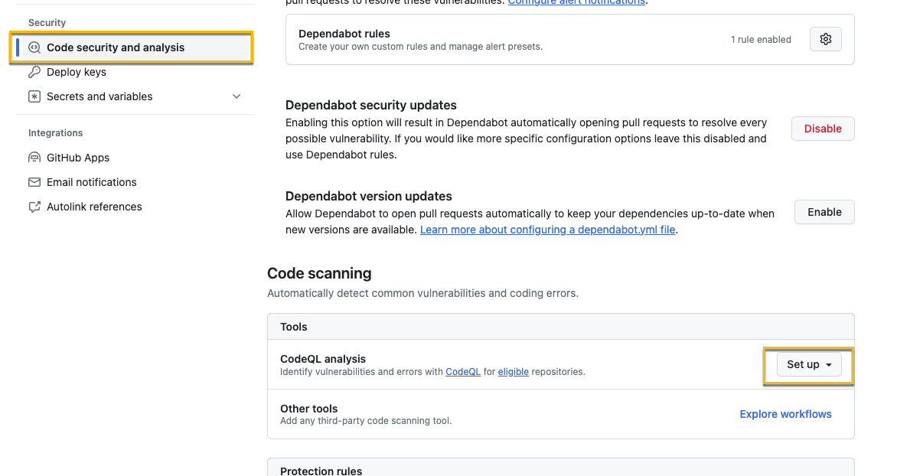

# Task 03 - Implement auto-scaling in the template (20 minutes)

## Introduction

The Munson's Pickles and Preserves Team Messaging System is up and running! They even have a proper Git Flow to protect against unintended changes to the main branch, and are recording application telemetry into App Insights. Before we are truly production-ready, though, there is one topic we have to cover: security.

One good DevOps practice is to enable protections against code-level vulnerabilities, and GitHub provides a number of useful features in this area. First, there are Issues, which allow developers or users to open 'tickets' indicating bugs to be fixed or potential vulnerabilities. If your organization prefers security flaws to be reported in a location other than GitHub, you have the option to provide a custom Security policy which describes the process for reporting.

In addition to these manual processes, GitHub also provides automated tools for scanning code for common errors. In this task, you will utilize the built-in Dependabot, which provides alerts if your repository contains libraries, packages, or external dependencies with known vulnerabilities. You will also set up a workflow with CodeQL, which can scan your source code for common coding errors or basic security flaws. This will help to ensure that the Team Messaging System contains code without any known vulnerabilities.

## Description

In this task, you will improve the security of your repository using some of GitHub's built-in tools.

1. Ask GitHub Copilot, "What do I need in a GitHub repository's security file?"
2. Find the repository's Security policy. If there is an existing policy, make an edit and merge your change back into the main branch. Otherwise, create a policy using the template provided. GitHub Security policies are Markdown documents that indicate the preferred way to report security vulnerabilities for the repository.
3. Ask GitHub Copilot, "How do I enable Dependabot alerts on a GitHub repository?" Then, enable Dependabot alerts for the repository. Dependabot is an automated tool that creates a pull request when any dependencies in the code base has a known vulnerability.
4. Ask GitHub Copilot, "How do I create a code scanning workflow in a GitHub repository?" After that, set up and run a Code scanning workflow for the repository using GitHub's 'CodeQL Analysis.' This workflow can run either on each pull request or on a schedule, and it checks your code for common vulnerabilities or errors.
5. Ask GitHub Copilot, "How can I view the results of a CodeQL analysis in GitHub?" Then, navigate to the results.
6. You should have one security issue from code scanning. Review the security issue and read up on how to correct the issue. Create a new GitHub Issue and feature branch. Then, resolve the issue, using GitHub Copilot to assist you.

## Success Criteria

- In GitHub, you should be able to view the 'closed' pull request which either created or updated the Security policy (SECURITY.md file).
- Additionally, you should be able to view a new 'open' pull request created by Dependabot requesting an update of a dependency.
- Finally, you should be able to view the results of the CodeQL Analysis in the Security tab.

## Learning Resources

- [Learn more about adding a security policy to your repository](https://docs.github.com/en/github/managing-security-vulnerabilities/adding-a-security-policy-to-your-repository).
- [Learn more about Dependabot and vulnerable dependencies](https://docs.github.com/en/github/managing-security-vulnerabilities/managing-vulnerabilities-in-your-projects-dependencies).
- [Learn more about automated code scanning and understanding results](https://docs.github.com/en/github/finding-security-vulnerabilities-and-errors-in-your-code).

## Tips

- If you are stuck, check out the 'Security' tab of your repository on GitHub.

## Solution

<details markdown="block">
<summary>Expand this section to view the solution</summary>

1. Select **Settings** in your repo, then **Code security and analysis**. Select **Enable** on "Dependabot alerts" and "Dependabot security updates."

    

    **Note** This will also automatically enable "Dependency graph."
2. Navigate to [https://github.com/electron/electron/blob/main/SECURITY.md](https://github.com/electron/electron/blob/main/SECURITY.md) for information about security policies. This is an example of a sample security policy that you could use for this exercise.
3. In your GitHub repo, select **Security**, **Policy**, and **Start setup**

   

4. Paste the security policy into the Markdown file (you can overwrite what is there now) and update it for the Munson's Pickles and Preserves Team Messaging System and the GitHub repo your code is in. Then, commit the changes to the main branch.

   

5. Next, we need to enable CodeQL. Select **Settings** and then **Code security and analysis**.
6. Scroll down if needed and select **Set up** in "Code scanning" for "CodeQL analysis."

    

7. If you select "Default", the code scan will immediately be run. For this exercise, select **Advanced**.

    

8. By choosing the advanced option, you can see the YAML for the pipeline that actually performs the code check. We don't need to make any changes here, but it's something you should be familiar with. An easy change to make in this file would be if you want to adjust the schedule of when the scan runs.

    

    After you've reviewed the YAML, commit the change to main.

    

9. After you've committed the change, select **Actions** and you should see your CodeQL Scan workflow running.

    

10. After about 5 minutes, you should see the workflow has completed.

    

11. After it's complete, go back to **Settings** and **Code security and analysis**. Then, select the ellipsis **...** next to the "Set up" menu. From the ellipsis dropdown, explore each of the first two options: "View last scan log" and "View Code Scanning alerts." You will find one High-risk vulnerability around arbitrary file access during archive extraction.

    {: .note }
    > This page will still show "Set up" because we chose the Advanced option instead of Basic.

    

12. Select the alert and then choose "Show more" to view details on the security issue. It turns out that an attacker could traverse to an arbitrary directory based on the way the MP&P staff wrote this function. In order to correct the function and prevent a directory traversal attack, replace `WriteToDirectory()` with the following code:

    ```csharp
    public static void WriteToDirectory(ZipArchiveEntry entry, string destDirectory)
    {
        string destFileName = Path.GetFullPath(Path.Combine(destDirectory, entry.FullName));
        string fullDestDirPath = Path.GetFullPath(destDirectory + Path.DirectorySeparatorChar);
        if (!destFileName.StartsWith(fullDestDirPath)) {
            throw new System.InvalidOperationException("Entry is outside the target dir: " + destFileName);
        }
        entry.ExtractToFile(destFileName);
    }
    ```

    Commit the code and create a pull request to the main branch. You should then see a CodeQL scan for the pull request, and after it succeeds, complete the pull request. Then, return to the code scanning results view and confirm that no issues remain on the list.

</details>
